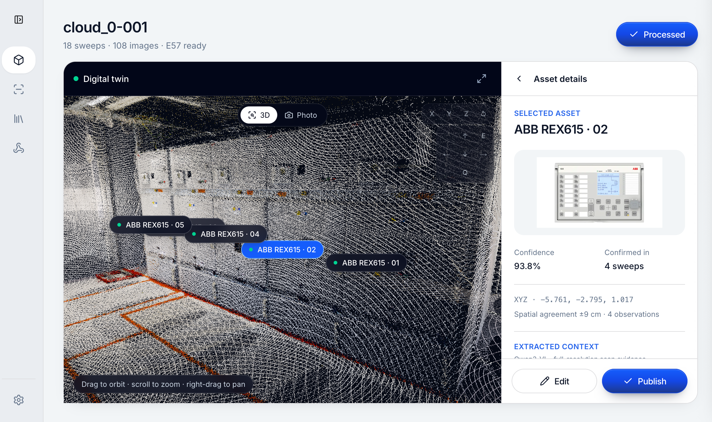

# TwinTag Backend

Backend services for turning industrial digital-twin scans into reviewed, interactive asset tags.

Built for the VEO360 challenge at JunctionX Vaasa: four relay reference views become a synthetic training dataset, YOLO11m detects equipment in real scan images, and E57 geometry combines repeated observations into 3D tags. Pretrained Qwen3-VL extracts nearby labels and inspection context for review alongside equipment manuals.




The demo processes 108 scan images into 38 detector observations and 7 fused asset-tag proposals. See [model performance and training records](MODEL_PERFORMANCE.md) for the validation metrics, inference confidence threshold, and training provenance.

## Training performance

YOLO11m was trained on a **RunPod NVIDIA RTX 4090**, using **8,000 training images and 2,000 synthetic validation images**. The saved checkpoint from epoch 8 achieved:

| Metric | Result |
| --- | --- |
| mAP@50 | 99.5% |
| mAP@50–95 | 99.49% |
| Precision | 100% |
| Recall | 99.995% |

The [training log](docs/model/rex615-training-results.csv) contains 10 epochs. Real-scan inference used an 85% confidence cutoff; this is separate from the synthetic validation scores above.

The original hackathon session's recorded execution outputs confirm the GPU and dataset split. See [run provenance](docs/model/training-provenance.json).

## Run locally

```bash
uv sync
uv run twintag-backend
```

Run checks with `uv run pytest` and `uv run ruff check .`.

The API runs on `http://localhost:8000`; pair it with the [TwinTag frontend](https://github.com/itsdaxen/twintag-frontend). Install detector dependencies with `uv sync --extra inference` when running YOLO inference locally. Model weights and scan artifacts are local inputs and are not included in the repository.

## Context OCR

TwinTag selects the largest full-resolution evidence view for each detected asset, then
uses Qwen3-VL to separate official labels, inspection markings, and unverified field
notes. The checked-in JSON contains genuine precomputed inference for the demo scan,
produced with the pretrained model; this was inference, not additional model training.

```bash
uv run python scripts/export_context_crops.py artifacts/veo-reference/images /tmp/context-crops
python -m venv .venv-ocr
.venv-ocr/bin/pip install -r scripts/requirements-ocr.txt
.venv-ocr/bin/python scripts/run_context_ocr.py /tmp/context-crops \
  src/twintag_backend/fixtures/data/context_ocr_qwen3_vl_8b.json
```
